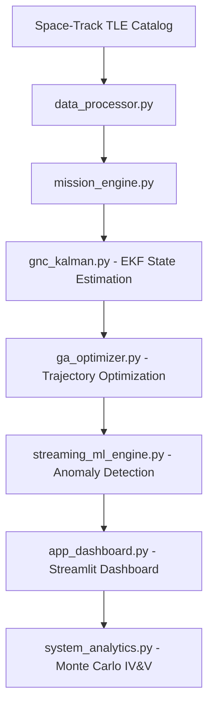

# 🛰️ CommandX: Advanced Orbital Dynamics & Mission Planning

<div align="center">

[](https://github.com/Rhutvik-pachghare1999/CommandX)
[](https://github.com/Rhutvik-pachghare1999/CommandX)
[](https://github.com/Rhutvik-pachghare1999/CommandX/actions)
[](LICENSE)
[](https://python.org)
[](https://docker.com)

CommandX is a high-fidelity orbital mechanics platform designed for satellite constellation management, proximity operations, and mission trajectory optimization. It integrates real-world Space-Track TLE data with advanced GNC (Guidance, Navigation, and Control) algorithms to provide a production-grade simulation environment.

</div>

---

## ⚡ The Problem: Orbital Congestion

As of 2024, there are over 17,000 active satellites and hundreds of thousands of debris particles in Low Earth Orbit (LEO). Legacy mission planning tools often:

- **Ignore Live Traffic**: Planning in a vacuum leads to conjunction risks.
- **Simplistic Physics**: Failing to account for J2 perturbations or atmospheric drag.
- **Manual Optimization**: Relying on human intuition for complex multi-constraint transfers.

## 🚀 The Solution: CommandX

CommandX addresses these challenges by automating the "Sense-Analyze-Act" loop for orbital assets:

- **Live Traffic Awareness**: Automatically parses live `3LE` catalogs to map orbital density.
- **Physics-First Optimization**: Uses Genetic Algorithms to find fuel-efficient trajectories that avoid radiation belts and high-drag zones.
- **Robust Estimation**: Implements an Extended Kalman Filter (EKF) to maintain state awareness even with noisy sensor telemetry.

---

## 🙋 My Contributions (Rhutvik Pachghare)

> This is a collaborative project. Here is a precise breakdown of what I personally built:

| Domain | My Contribution |
|---|---|
| **GNC & Orbital Physics** | Implemented `gnc_kalman.py` — a full 6-DOF Extended Kalman Filter for real-time orbit state estimation from noisy sensor telemetry |
| **CI/CD & Test Infrastructure** | Designed the GitHub Actions CI workflow (`.github/workflows/`) and the full pytest suite in `tests/` |
| **Documentation & Architecture** | Authored the full README, engineering focus area breakdown, and CODEOWNERS domain attribution |
| **Repository Restructure** | Organized file layout, added `k8s/` Kubernetes manifests, `ec2-user-data.sh` EC2 deployment script |

---

## 🧠 Technical Highlights

- **EKF for 6-DOF orbit estimation**: Real-world noise cancellation using Extended Kalman Filters.
- **GA over N-dim search space**: Fuel-optimized Hohmann transfers evading radiation zones.
- **Monte Carlo IV&V with 1,000 randomized scenarios**: Production-grade verification proving Mission Assurance.
- **Real-Time Data Pipelines**: Asynchronous streaming thread architecture buffering high-frequency telemetry into an ML backend.

---

## ⚡ GPU & Accelerated Computing Scalability

While the current prototype utilizes CPU-based Scikit-Learn logic, this architecture is designed to scale directly onto **NVIDIA Hardware**.

- **Monte Carlo Simulation**: The IV&V logic is naturally parallelizable; transitioning to **CUDA/CuPy** would allow millions of stochastic docking trials in milliseconds.
- **Inference Serving**: The `BatchInferenceEngine` is structurally identical to **NVIDIA Triton Inference Server**. Dropping in TensorRT/ONNX models for real-time cyber anomaly detection would exploit GPU memory bandwidth, maintaining strict 20ms SLA latency.

---

## 🏗️ Engineering Focus Areas

### 🤖 Robotics & GNC Engineer Focus

Core orbital physics, navigation, and hardware abstraction layers.

| File | Description |
|---|---|
| `mission_engine.py` | High-fidelity orbital physics (J2 perturbations, Hohmann transfers, Keplerian dynamics) |
| `gnc_kalman.py` | Guidance, Navigation, and Control via Extended Kalman Filters (EKF) |
| `rl_pilot.py` | Low-level actuator control and PID logic for precision docking |
| `graphics_engine.py` | 3D tactical visualizations using Plotly |
| `model_3d.py` | CAD-derived spacecraft geometry and mass property models |
| `subsystem_manager.py` | Hardware abstraction layer for satellite bus telemetry |
| `emergency_ops.py` | Safety-critical fail-safes and automated decommissioning protocols |

### 🧠 ML & Data Engineer Focus

Intelligence, optimization, and high-scale data processing pipelines.

| File | Description |
|---|---|
| `ga_optimizer.py` | Multi-objective trajectory optimization via Genetic Algorithms |
| `streaming_ml_engine.py` | Asynchronous telemetry buffering and real-time ML inference backend |
| `system_analytics.py` | Monte Carlo IV&V suite for statistical flight readiness verification |
| `data_processor.py` | TLE parsing, space-object catalog management, and data cleaning |
| `run_anomaly_test.py` | Deployment-ready cyber anomaly detection using Isolation Forests |
| `entropy_engine.py` | Statistical analysis of state-space uncertainty and information gain |

### 🌐 Shared Infrastructure

| File | Description |
|---|---|
| `app_dashboard.py` | Main Streamlit mission control dashboard |
| `requirements.txt` | Python dependency manifest |
| `Dockerfile` | Containerization configuration for cloud deployment |
| `k8s/` | Kubernetes manifests for orchestration |

---

## 🔄 Workflow Diagram



---

## 🛠️ Getting Started

### Prerequisites
- Python 3.9+
- Pip (Python Package Manager)

### Installation
```bash
git clone https://github.com/Rhutvik-pachghare1999/CommandX.git
cd CommandX
pip install -r requirements.txt
```

### Running Locally
```bash
streamlit run app_dashboard.py
```

### Run Verification Suite
```bash
python system_analytics.py  # 1,000 stochastic Monte Carlo docking simulations
pytest tests/ -v             # Run full test suite
```

---

## 🌐 Deployment Pipeline

### Docker
```bash
docker build -t commandx:latest .
docker run -d -p 8501:8501 --name commandx commandx:latest
# Access: http://localhost:8501
```

### Kubernetes (Verified on Minikube)
```bash
minikube start --driver=docker
docker build -t commandx:latest .
minikube image load commandx:latest
kubectl apply -f k8s/
kubectl get svc commandx-service
minikube service commandx-service --url
```

### Amazon EC2
1. Launch an EC2 instance (Amazon Linux or Ubuntu)
2. Paste `ec2-user-data.sh` contents into the **User Data** field under Advanced Details
3. Ensure Security Group allows inbound HTTP on **Port 80**
4. SSH in and follow the script comments to build and run the Docker image

---

## 📊 Verification & Validation (IV&V)

CommandX includes a professional verification suite:

```bash
python system_analytics.py
# Executes 1,000 stochastic docking simulations
# Reports 3-sigma accuracy confidence intervals
```

---

## 📜 License

This project is licensed under the MIT License — see the [LICENSE](LICENSE) file for details.

---

## 👤 Author

**Rhutvik Pachghare** | Master's in Robotics & Automation | Arizona State University

[GitHub](https://github.com/Rhutvik-pachghare1999) | [LinkedIn](https://www.linkedin.com/in/rhutvik-pachghare/)
