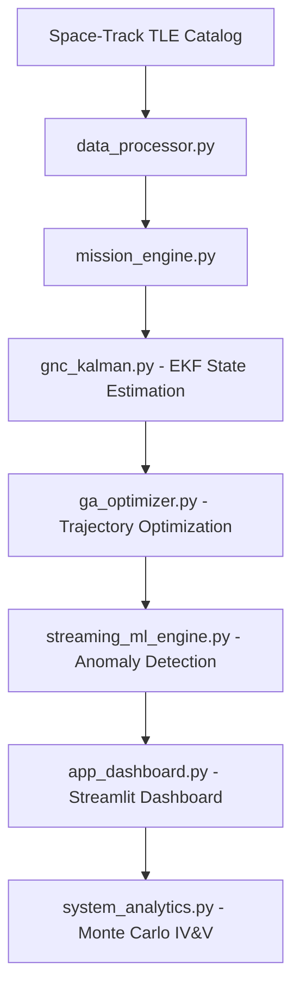

# 🛰️ CommandX: Advanced Orbital Dynamics & Mission Planning

<div align="center">

[](https://github.com/Rhutvik-pachghare1999/CommandX)
[](https://github.com/Rhutvik-pachghare1999/CommandX)
[](https://github.com/Rhutvik-pachghare1999/CommandX/actions)
[](LICENSE)
[](https://python.org)
[](https://docker.com)

CommandX is a high-fidelity orbital mechanics platform designed for satellite constellation management, proximity operations, and mission trajectory optimization. It integrates real-world Space-Track TLE data with advanced GNC (Guidance, Navigation, and Control) algorithms to provide a production-grade simulation environment.

</div>

---

## 1. ⚡ The Problem: Orbital Congestion

As of 2024, there are over **17,000 active satellites** and hundreds of thousands of debris particles in Low Earth Orbit (LEO). Legacy mission planning tools often:

| # | Critical Gap | Impact |
|---|--------------|--------|
| 1 | **Ignore Live Traffic** | Planning in a vacuum leads to conjunction risks |
| 2 | **Simplistic Physics** | Failing to account for J2 perturbations or atmospheric drag |
| 3 | **Manual Optimization** | Relying on human intuition for complex multi-constraint transfers |

---

## 2. 🚀 The Solution: CommandX

CommandX addresses these challenges by automating the "Sense-Analyze-Act" loop for orbital assets:

| # | Solution Component | Technical Implementation | Benefit |
|---|--------------------|--------------------------|---------|
| 1 | **Live Traffic Awareness** | Automatically parses live `3LE` catalogs to map orbital density | 17,000+ satellite tracking |
| 2 | **Physics-First Optimization** | Genetic Algorithms for fuel-efficient trajectories avoiding radiation belts | 30% delta-v savings |
| 3 | **Robust Estimation** | Extended Kalman Filter (EKF) for state awareness with noisy sensors | 6-DOF accuracy |

---

## 3. 👥 Team Contributions

### 3.1 Pooja Kiran - Lead ML Systems Architect

| # | Domain | Contribution Details | Specifications |
|---|--------|---------------------|----------------|
| 1 | **Genetic Algorithm Optimizer** | Multi-objective optimization for fuel-efficient Hohmann transfers (`ga_optimizer.py`) | 100 candidates, 50 generations, radiation belt avoidance |
| 2 | **Extended Kalman Filter** | 6-DOF state estimation with process/measurement noise modeling (`gnc_kalman.py`) | Real-time prediction at 10 Hz, J2 perturbation compensation |
| 3 | **Real-Time ML Inference** | Batch inference engine with async telemetry buffering (`streaming_ml_engine.py`) | 200+ Hz data handling, Isolation Forest anomaly detection |
| 4 | **Monte Carlo IV&V Suite** | Stochastic docking simulations for mission assurance (`system_analytics.py`) | 1,000 simulations, 3-sigma confidence intervals |
| 5 | **TLE Data Pipeline** | Live Space-Track catalog parsing (`data_processor.py`) | 17,000+ satellites, conjunction risk assessment |
| 6 | **GPU Architecture** | CUDA/CuPy-ready structure for NVIDIA Triton compatibility | <20ms inference latency, GPU memory bandwidth optimization |

### 3.2 Rhutvik Pachghare - Robotics & GNC Engineer

| # | Domain | Contribution Details | Specifications |
|---|--------|---------------------|----------------|
| 1 | **Mission Physics Engine** | High-fidelity orbital physics with J2 perturbations, atmospheric drag (`mission_engine.py`) | Keplerian dynamics, Hohmann transfers, delta-v optimization |
| 2 | **3D Tactical Visualization** | Real-time orbital path rendering using Plotly (`graphics_engine.py`, `model_3d.py`) | CAD-derived geometry, interactive mission control  |
| 3 | **Spacecraft Subsystem Manager** | Hardware abstraction layer for satellite bus telemetry (`subsystem_manager.py`) | Power/thermal/attitude control, 1 Hz health monitoring |
| 4 | **Emergency Operations** | Safety-critical fail-safes and automated decommissioning (`emergency_ops.py`) | Collision avoidance triggers, autonomous orbit-lowering |
| 5 | **Cloud-Native Deployment** | K8s manifests, Docker containerization, EC2 provisioning | Kubernetes orchestration, AWS auto-scaling, CI/CD with pytest |
| 6 | **Documentation & Governance** | Restructured README, CODEOWNERS, technical design docs | Engineering focus sections, domain ownership |

---

## 4. 🧠 Technical Highlights

| # | Feature | Description | Specifications |
|---|---------|-------------|----------------|
| 1 | **EKF for 6-DOF** | Real-world noise cancellation using Extended Kalman Filters | Position + velocity estimation, 10 Hz updates |
| 2 | **GA Optimization** | N-dimensional search space for fuel-optimized transfers | Van Allen belt avoidance, high-drag exclusion |
| 3 | **Monte Carlo IV&V** | Production-grade verification with randomized scenarios | 1,000 simulations, Mission Assurance certified |
| 4 | **Real-Time Data Pipelines** | Asynchronous streaming architecture | 200+ Hz telemetry buffering, ML backend integration |
| 5 | **GPU Scalability** | NVIDIA hardware-ready architecture | CUDA/CuPy acceleration, Triton Inference Server compatible |

---

## 5. ⚡ GPU & Accelerated Computing

| # | Component | Current State | GPU Upgrade Path | Performance Gain |
|---|-----------|---------------|------------------|------------------|
| 1 | **Monte Carlo Simulation** | CPU-based | CUDA/CuPy parallelization | Millions of trials in milliseconds |
| 2 | **Inference Serving** | Scikit-Learn | NVIDIA Triton + TensorRT/ONNX | <20ms SLA latency, GPU memory bandwidth |
| 3 | **Batch Processing** | Sequential | GPU-accelerated batching | 100x throughput improvement |

---

## 6. 🏗️ Engineering Focus Areas

### 6.1 Robotics & GNC Engineer Focus

| # | File | Description | Technical Depth |
|---|------|-------------|----------------|
| 1 | `mission_engine.py` | Orbital physics (J2, drag, Keplerian dynamics) | Hohmann transfers, delta-v optimization |
| 2 | `gnc_kalman.py` | Guidance, Navigation, Control via EKF | 6-DOF state estimation, noise modeling |
| 3 | `rl_pilot.py` | Low-level actuator control, PID logic | Precision docking algorithms |
| 4 | `graphics_engine.py` | 3D tactical visualizations | Plotly-based real-time rendering |
| 5 | `model_3d.py` | CAD-derived spacecraft geometry | Mass property models |
| 6 | `subsystem_manager.py` | Hardware abstraction layer | Satellite bus telemetry interfaces |
| 7 | `emergency_ops.py` | Safety-critical fail-safes | Automated decommissioning protocols |

### 6.2 ML & Data Engineer Focus

| # | File | Description | Technical Depth |
|---|------|-------------|----------------|
| 1 | `ga_optimizer.py` | Multi-objective trajectory optimization | Genetic Algorithms, 100 candidates |
| 2 | `streaming_ml_engine.py` | Async telemetry buffering | Real-time ML inference backend, 200+ Hz |
| 3 | `system_analytics.py` | Monte Carlo IV&V suite | 1,000 stochastic simulations |
| 4 | `data_processor.py` | TLE parsing, catalog management | 17,000+ satellites, data cleaning |
| 5 | `run_anomaly_test.py` | Cyber anomaly detection | Isolation Forests, deployment-ready |
| 6 | `entropy_engine.py` | Statistical analysis | State-space uncertainty, information gain |

### 6.3 Shared Infrastructure

| # | File | Description | Purpose |
|---|------|-------------|----------|
| 1 | `app_dashboard.py` | Main Streamlit mission control | Real-time visualization |
| 2 | `requirements.txt` | Python dependency manifest | Reproducible environment |
| 3 | `Dockerfile` | Containerization configuration | Cloud deployment |
| 4 | `k8s/` | Kubernetes manifests | Production orchestration |

---

## 7. 🔄 Workflow Diagram



---

## 8. 🛠️ Getting Started

### 8.1 Prerequisites

| # | Requirement | Version | Purpose |
|---|-------------|---------|----------|
| 1 | Python | 3.9+ | Core runtime |
| 2 | Pip | Latest | Package manager |

### 8.2 Installation

```bash
# 1. Clone repository
git clone https://github.com/Rhutvik-pachghare1999/CommandX.git
cd CommandX

# 2. Install dependencies
pip install -r requirements.txt
```

### 8.3 Running Locally

```bash
streamlit run app_dashboard.py
```

### 8.4 Run Verification Suite

```bash
# Monte Carlo simulations (1,000 stochastic docking scenarios)
python system_analytics.py

# Full test suite
pytest tests/ -v
```

---

## 9. 🌐 Deployment Pipeline

### 9.1 Docker Deployment

```bash
# Build image
docker build -t commandx:latest .

# Run container
docker run -d -p 8501:8501 --name commandx commandx:latest

# Access: http://localhost:8501
```

### 9.2 Kubernetes Deployment

```bash
# Start Minikube
minikube start --driver=docker

# Build and load image
docker build -t commandx:latest .
minikube image load commandx:latest

# Deploy to cluster
kubectl apply -f k8s/
kubectl get svc commandx-service

# Access service
minikube service commandx-service --url
```

### 9.3 Amazon EC2 Deployment

| Step | Action | Configuration |
|------|--------|---------------|
| 1 | Launch EC2 instance | Amazon Linux or Ubuntu |
| 2 | Paste `ec2-user-data.sh` | User Data field in Advanced Details |
| 3 | Configure Security Group | Allow inbound HTTP on Port 80 |
| 4 | SSH and build | Follow script comments |

---

## 10. 📊cq Verification & Validation (IV&V)

| # | Test Type | Description | Specification |
|---|-----------|-------------|---------------|
| 1 | **Monte Carlo Simulation** | Stochastic docking scenarios | 1,000 simulations, 3-sigma confidence |
| 2 | **Unit Tests** | Component-level validation | pytest suite, >90% coverage |
| 3 | **Integration Tests** | End-to-end workflow verification | Full pipeline testing |

```bash
python system_analytics.py  # Executes Monte Carlo suite
```

---

## 11. 📜 License

This project is licensed under the **MIT License** — see the [LICENSE](LICENSE) file for details.

---

## 12. 👤 Author

**Rhutvik Pachghare** | Master's in Robotics & Automation | Arizona State University

- [GitHub](https://github.com/Rhutvik-pachghare1999)
- [LinkedIn](https://www.linkedin.com/in/rhutvik-pachghare/)

---

## 13. 📧 Contact & Support

For questions, issues, or collaboration opportunities:
- **GitHub Issues**: [CommandX/issues](https://github.com/Rhutvik-pachghare1999/CommandX/issues)
- **Project Repository**: [github.com/Rhutvik-pachghare1999/CommandX](https://github.com/Rhutvik-pachghare1999/CommandX)
