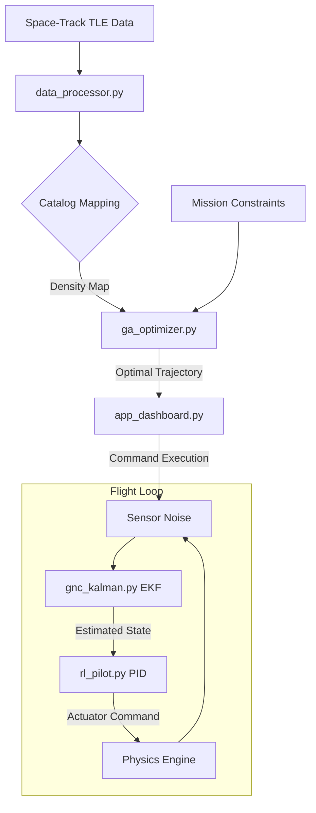

# 🛰️ CommandX: Advanced Orbital Dynamics & Mission Planning

[](https://github.com/poojakira/CommandX)
[](https://github.com/poojakira/CommandX)
[](LICENSE)

CommandX is a high-fidelity orbital mechanics platform designed for satellite constellation management, proximity operations, and mission trajectory optimization. It integrates real-world Space-Track TLE data with advanced GNC (Guidance, Navigation, and Control) algorithms to provide a production-grade simulation environment.

---

## ⚡ The Problem: Orbital Congestion
As of 2024, there are over 17,000 active satellites and hundreds of thousands of debris particles in Low Earth Orbit (LEO). Legacy mission planning tools often:
- **Ignore Live Traffic**: Planning in a vacuum leads to conjunction risks.
- **Simplistic Physics**: Failing to account for J2 perturbations or atmospheric drag.
- **Manual Optimization**: Relying on human intuition for complex multi-constraint transfers.

## 🚀 The Solution: CommandX
CommandX addresses these challenges by automating the "Sense-Analyze-Act" loop for orbital assets:
- **Live Traffic Awareness**: Automatically parses live `3LE` catalogs to map orbital density.
- **Physics-First Optimization**: Uses Genetic Algorithms to find fuel-efficient trajectories that avoid radiation belts and high-drag zones.
- **Robust Estimation**: Implements an Extended Kalman Filter (EKF) to maintain state awareness even with noisy sensor telemetry.

---

## 🎥 System Demonstration
*(Placeholder: [Insert high-quality GIF of Dashboard here])*
*(Placeholder: [Insert 3D Orbit Visualization Screenshot here])*

## 🧠 Technical Highlights
- **EKF for 6-DOF orbit estimation**: Real-world noise cancellation using Extended Kalman Filters.
- **GA over N-dim search space**: Fuel-optimized Hohmann transfers evading radiation zones.
- **Monte Carlo IV&V with 1,000 randomized scenarios**: Production-grade verification proving Mission Assurance.
- **Real-Time Data Pipelines**: Asynchronous streaming thread architecture buffering high-frequency telemetry into an ML backend.

## ⚡ Why This Matters for GPU / Accelerated Computing
While the current prototype utilizes CPU-based Scikit-Learn logic, this architecture is designed to scale directly onto **NVIDIA Hardware**.
- **Monte Carlo Simulation**: The IV&V logic is naturally paralyzable; transitioning to **CUDA/CuPy** would allow millions of stochastic docking trials in milliseconds instead of seconds.
- **Inference Serving**: The `BatchInferenceEngine` utilizes dynamic batching, structurally identical to **NVIDIA Triton Inference Server**. Dropping in TensorRT/ONNX models for real-time cyber anomaly detection would exploit GPU memory bandwidth, maintaining the strict 20ms SLA latency over astronomical distributed-telemetry volumes.

---

## 🏗️ Engineering Focus Areas

CommandX is built at the intersection of orbital mechanics and machine learning. Below is a breakdown of the repository based on engineering specialization.

### 🤖 Robotics & GNC Engineer Focus
Core orbital physics, navigation, and hardware abstraction layers.
- **[mission_engine.py](file:///home/rhutvik/CommandX/mission_engine.py)**: High-fidelity orbital physics (J2 perturbations, Hohmann transfers, Keplerian dynamics).
- **[gnc_kalman.py](file:///home/rhutvik/CommandX/gnc_kalman.py)**: Guidance, Navigation, and Control via Extended Kalman Filters (EKF).
- **[rl_pilot.py](file:///home/rhutvik/CommandX/rl_pilot.py)**: Low-level actuator control and PID logic for precision docking.
- **[graphics_engine.py](file:///home/rhutvik/CommandX/graphics_engine.py)**: 3D tactical visualizations using Plotly.
- **[model_3d.py](file:///home/rhutvik/CommandX/model_3d.py)**: CAD-derived spacecraft geometry and mass property models.
- **[subsystem_manager.py](file:///home/rhutvik/CommandX/subsystem_manager.py)**: Hardware abstraction layer for satellite bus telemetry.
- **[emergency_ops.py](file:///home/rhutvik/CommandX/emergency_ops.py)**: Safety-critical fail-safes and automated decommissioning protocols.

### 🧠 ML & Data Engineer Focus
Intelligence, optimization, and high-scale data processing pipelines.
- **[ga_optimizer.py](file:///home/rhutvik/CommandX/ga_optimizer.py)**: Multi-objective trajectory optimization via Genetic Algorithms.
- **[streaming_ml_engine.py](file:///home/rhutvik/CommandX/streaming_ml_engine.py)**: Asynchronous telemetry buffering and real-time ML inference backend.
- **[system_analytics.py](file:///home/rhutvik/CommandX/system_analytics.py)**: Monte Carlo IV&V suite for statistical flight readiness verification.
- **[data_processor.py](file:///home/rhutvik/CommandX/data_processor.py)**: TLE parsing, space-object catalog management, and data cleaning.
- **[run_anomaly_test.py](file:///home/rhutvik/CommandX/run_anomaly_test.py)**: Deployment-ready cyber anomaly detection using isolation forests.
- **[entropy_engine.py](file:///home/rhutvik/CommandX/entropy_engine.py)**: Statistical analysis of state-space uncertainty and information gain.

### 🌐 Shared Infrastructure
Common utilities and project entry points.
- **[app_dashboard.py](file:///home/rhutvik/CommandX/app_dashboard.py)**: The main Streamlit mission control dashboard.
- **[requirements.txt](file:///home/rhutvik/CommandX/requirements.txt)**: Python dependency manifest.
- **[Dockerfile](file:///home/rhutvik/CommandX/Dockerfile)**: Containerization configuration for cloud deployment.
- **[k8s/](file:///home/rhutvik/CommandX/k8s/)**: Kubernetes manifests for orchestration.

---

## 🔄 Workflow Diagram



---

## 🛠️ Getting Started

### Prerequisites
- Python 3.9+
- Pip (Python Package Manager)

### Installation
1. Clone the repository:
   ```bash
   git clone https://github.com/poojakira/CommandX.git
   cd CommandX
   ```
2. Install dependencies:
   ```bash
   pip install -r requirements.txt
   ```

### Running Locally
Launch the Mission Control dashboard natively using Python:
```bash
streamlit run app_dashboard.py
```

## 🌐 Deployment Pipeline

### Deploying with Docker
You can containerize the CommandX pipeline using the provided `Dockerfile`.
1. Build the Docker image:
   ```bash
   docker build -t commandx:latest .
   ```
2. Run the container:
   ```bash
   docker run -d -p 8501:8501 --name commandx commandx:latest
   ```
Access the application at `http://localhost:8501`.

### Deploying with Kubernetes
We provide Kubernetes manifests in the `k8s/` directory.

**(Verified Locally on Minikube)**
1. If using [Minikube](https://minikube.sigs.k8s.io/), ensure your local Docker daemon is running and execute:
   ```bash
   minikube start --driver=docker
   # Build the image and load it into minikube
   docker build -t commandx:latest .
   minikube image load commandx:latest
   ```
2. Apply the deployment and service configurations:
   ```bash
   kubectl apply -f k8s/
   ```
3. Retrieve the external IP (or map to localhost via minikube service alias):
   ```bash
   kubectl get svc commandx-service
   # For Minikube users:
   minikube service commandx-service --url
   ```
### Deploying to Amazon EC2
We provide an `ec2-user-data.sh` script to auto-provision an EC2 instance.
1. Launch an EC2 instance (Amazon Linux or Ubuntu) and paste the contents of `ec2-user-data.sh` into the **User Data** field under Advanced Details.
2. Ensure your Security Group allows inbound HTTP traffic on **Port 80**.
3. Once provisioned, SSH into the instance and follow the instructions in the script comments to build and run the Docker image.

---

## 📊 Verification & Validation (IV&V)
CommandX includes a professional verification suite to ensure flight readiness. You can run a standalone Monte Carlo analysis to verify GNC robustness:
```bash
python system_analytics.py
```
This will execute 1,000 stochastic docking simulations and report 3-sigma accuracy confidence intervals.

---

## 📜 License
This project is licensed under the MIT License - see the [LICENSE](LICENSE) file for details.
