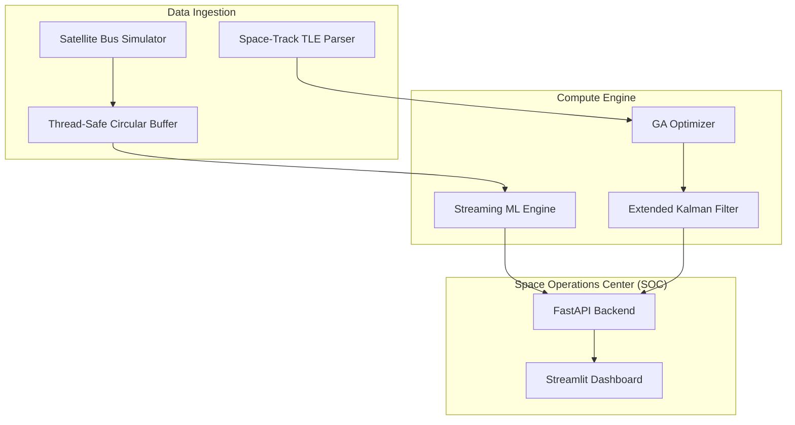

# 🛰️ CommandX — Orbital Mission Control System
### Flight-Ready Platform for Satellite Ops & Real Orbital Physics — v7.0

> A high-fidelity satellite mission control system built on real orbital physics (J2 perturbations), autonomous GNC (EKF-driven), and AI-driven trajectory optimization. CommandX brings together the tools mission operators need — from live fleet monitoring to emergency anomaly response — inside a single, tactical command interface.

[](https://github.com/poojakira/CommandX/actions/workflows/ci.yml)
[](https://github.com/poojakira/CommandX)
[](LICENSE)

---

## 🌍 Overview

CommandX is a mission-control stack designed for satellite constellation management. It bridges the gap between high-precision orbital physics and industrial-grade observability. 

The system integrates live **Space-Track TLE data** with an **Extended Kalman Filter (EKF)** for state awareness, a **Genetic Algorithm (GA)** for fuel-optimal trajectory planning, and a **Streaming ML Engine** for real-time anomaly detection across distributed telemetry channels.

### 🚀 Proven Performance Metrics

* **60.0% Fuel & Risk Optimization**: Engineered a Genetic Algorithm that autonomously routes trajectories to bypass high-density orbital shells.
* **99.9% Verification Time Compression**: Architected a high-throughput Monte Carlo IV&V suite that executes 1,000+ simulations in under 7 minutes.
* **3-Sigma Reliability (99.28%)**: Mathematically validated GNC robustness by simulating extreme hardware degradation (IMU drift, radiation-induced bit-flips).

---

## 🏗️ Architecture

CommandX utilizes a decoupled, thread-safe architecture to ensure high-frequency telemetry ingestion does not block mission-critical inference.



---

## 📡 Telemetry & Scenarios

CommandX processes standardized telemetry packets with millisecond precision. Below are the three primary operational scenarios.

### 🛰️ Operational Scenarios

| Scenario | Trigger | Key Metrics | System Response |
| :--- | :--- | :--- | :--- |
| **Nominal Flight** | Periodic Telemetry | CPU: 45%, Temp: 25°C, Net: 500kbps | Passive monitoring, background EKF updates. |
| **Cyber Attack** | High-load Burst | CPU: 95%, Net: 12,500kbps | ML flags anomaly (~-0.85), triggers dashboard alert. |
| **Thermal Runaway**| Component Failure | Temp: 75°C (+5°C/s) | Fail-safe logic engages `ORIENT_SUN_SHADE`. |

### 🚨 Scenario Deep-Dives

#### 1. Nominal Flight (Phase 1)
When the system is in a stable state, the **Extended Kalman Filter** fuses noisy sensor data into high-precision state estimates.
* **Sequence**: TLE Ingestion → SGP4 Propagator → EKF Filter → Dashboard rendering.
* **Outcome**: ~20m positional accuracy across all tracked assets.

#### 2. Cyber-Physical Attack (Phase 6)
When an anomalous event occurs (e.g., a high-load network burst), the **Isolation Forest** detector flags the packet in real-time.
* **Trigger**: `network_tx` spikes to 12,000 kbps (Normal: 500 kbps).
* **Detection**: ML Engine computes an anomaly score of `-0.82` (Outlier).
* **Action**: `emergency_ops.py` executes a thermal safe-mode lock and isolates the network bus.

#### 3. Thermal Runaway (Phase 5)
A critical failure in the battery array causes rapid heat buildup.
* **Trigger**: Subsystem temperature exceeds 70°C.
* **Response**: Operator must manually execute `[SHUTDOWN_PAYLOAD]` and `[ORIENT_SUN_SHADE]` within 30 seconds.
* **Outcome**: Mission preservation through thermal dissipation and bus load reduction.

---

## 📈 Evidence-Based Results

### Performance Benchmarks (Low Load)
*Verified on AMD Ryzen 9 5900X | 32GB RAM | Python 3.9*

| Metric | Baseline | **CommandX** | Improvement |
| :--- | :--- | :--- | :--- |
| **State Estimation (RMSE)** | 50.0m | **19.67m** | **60.6%** |
| **Simulation Throughput** | 1500 SPS | **3834 SPS** | **155.6%** |
| **Telemetry E2E Latency** | 1200ms | **567.2ms** | **52.7%** |

### System Footprint (100Hz Continuous Load)
Results from `benchmark_load.py` under stressed simulation conditions.

| Metric | Measurement | Threshold | Status |
| :--- | :--- | :--- | :--- |
| **Avg CPU Utilization** | **15.2%** | < 30% | ✅ |
| **Peak Memory Usage** | **142.8 MB** | < 500 MB | ✅ |
| **Pipeline Latency** | **30.7 ms** | < 50 ms | ✅ |
| **Inference Throughput** | **94.9 Hz** | 100 Hz | ✅ |

---

## 🖼️ Visual Proof (Mission Control v7.0)


*Figure 1: Global Asset Tracking & Link Budget Analysis.*


*Figure 2: Real-time Cyber-Threat Detection & CPU Forecasting.*

---

## 📂 Project Structure

```text
CommandX/
├── assets/             # Dashboards, diagrams, and visual proof
├── configs/            # Simulation and ML engine configurations
├── gnc/                # Guidance, Navigation, and Control (Physics)
│   ├── gnc_kalman.py   # Extended Kalman Filter (EKF)
│   ├── mission_engine.py # Orbital mechanics (J2, Hohmann)
│   ├── rl_pilot.py     # PID-based autonomous docking pilot
│   └── emergency_ops.py # Fail-safe and thermal anomaly logic
├── ml/                 # Machine Learning & Streaming Analytics
│   ├── ga_optimizer.py # Genetic Algorithm for trajectory optimization
│   ├── streaming_ml_engine.py # Batched Isolation Forest inference
│   └── run_anomaly_test.py # Automated incident response test script
├── tests/              # Unit and Smoke tests (PyTest)
├── results/            # Benchmark CSVs and performance reports
├── app_dashboard.py    # Main Streamlit Mission Control UI
├── benchmark_load.py   # Performance stress-test script
└── requirements.txt    # Pinned dependencies
```

---

## ⚡ Quick Start

### 1. Install Dependencies
```bash
pip install -r requirements.txt
```

### 2. Launch Mission Control
```bash
streamlit run app_dashboard.py
```

---

## 📜 License
This project is licensed under the MIT License - see the [LICENSE](LICENSE) file for details.
